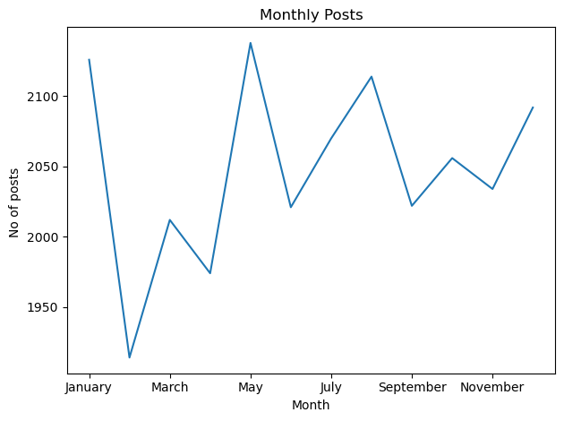

# Social_buzz

## Project Overview

This project is a simulation designed to mimic the role of a Data Analyst at Accenture. The objective was to advise a hypothetical social media client, **Social Buzz**, by analyzing their data and providing actionable insights. The focus was on helping Social Buzz optimize their social media strategies, enhance user engagement, and improve overall platform performance. 

## Client Background
Social Buzz was founded in 2008 by two former engineers from a major social media company. Based in San Francisco, the platform prioritizes content over users, offering over 100 reaction types. With over 500 million active users monthly and 100,000 daily content posts, Social Buzz has grown rapidly and employs 250 staff, 200 of whom are technical experts managing complex technology.

## Business Problem
Social Buzz faces challenges in managing its rapid growth with existing resources and requires expert guidance for effective scaling.
All of the data is highly unstructured and requires extremely sophisticated and expensive technology to manage and maintain.
The client has reached a massive scale within recent years and does not have the resources internally to handle it.

## Client Requirement
**Content Category Analysis**: Analyze content categories to identify the top 5 with the largest aggregate popularity.

## Process
* Data Gathering
* Data Cleaning
* Data modelling
* Data Analysis
* Uncovering Insights

## Tools used
* Python
* Pandas
* Matplotlib
* Excel

## Data Gathering
The client has sent through:

* 7 data sets - each data set contains different columns and values
* A data model - this shows the relationships between all of the data sets, as well as any links that you can use to merge tables.
  
I used this data model to identify which datasets will be required to answer your **business question - which is to to figure out the top 5 categories with the largest popularity**.
Out of the 7 datasets provided by the client, I select 3 to answer the business probelem.

## Data Cleaning
* removing rows that have values which are missing,
* changing the data type of some values within a column
* removing columns which are not relevant to this task.

## Data Modelling
Created a final data set by merging the three tables together (Reactions, ReactionType, Content)
I used the Reaction table as the base table, then joined the relevant columns from Content data set, and then the Reaction Types data set.

## Data Analysis
### What are the Top 5 Categories?

### What was the month with the most posts?

